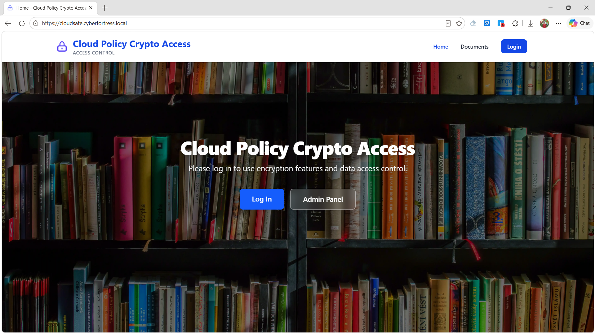
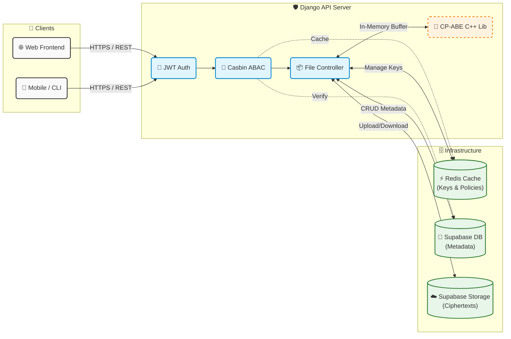

# Cloud Policy Crypto Access

A comprehensive enterprise-grade file storage system implementing **Hybrid Ciphertext-Policy Attribute-Based Encryption (CP-ABE)** integrated with **Supabase**, providing highly secure file management, multi-layer Attribute-Based Access Control (ABAC), and high-performance caching.

## Project Overview

This repository contains a robust Django-based implementation of a secure file sharing system. The system shifts away from traditional role-based security by enabling fine-grained access control mathematically bound to user attributes, providing zero-trust security for sensitive data.




See more demo images in `img/`.

### Key Features

- **Hybrid CP-ABE Encryption (v3.0.0)**: Advanced attribute-based encryption utilizing high-speed in-memory buffers (RAM) for encryption/decryption, completely bypassing disk I/O bottlenecks. See more at: https://github.com/WanThinnn/Hybrid-CP-ABE-Library.git 
- **Supabase Integration**: Leverages Supabase Storage for hosting encrypted files and Supabase PostgreSQL for high-performance metadata management.
- **Multi-Layer Security**: Combines **CP-ABE** (Mathematical Cryptography) with **Casbin ABAC** (Application-level Access Control) for defense-in-depth.
- **Advanced Policy Engine**: Implements an Abstract Syntax Tree (AST) evaluator for ABAC and CP-ABE policies, supporting arbitrarily complex nested boolean logic (e.g., `(A and B) or C`) with visual UI builder integration.
- **Intelligent Policy Combination**: Automatically re-encrypts and merges policies using `OR` logic when new access rights are granted to existing files.
- **Zero Frontend Key Exposure**: Private keys are strictly generated, utilized, and destroyed within the Backend's memory space.
- **Redis Caching**: Highly optimized Redis caching for CP-ABE Private Keys and Casbin policies, ensuring near-instantaneous file previews.
- **Dockerized Architecture**: Fully containerized environment with Nginx, Gunicorn, Django, and Redis for seamless production deployment.

## Technology Stack

### Backend & Infrastructure
- **Framework**: Django 5.x & Django REST Framework
- **Database & Storage**: Supabase PostgreSQL & Supabase Storage
- **Caching & Message Broker**: Redis 7
- **Web Server**: Nginx & Gunicorn
- **Deployment**: Docker & Docker Compose

### Security & Cryptography
- **Hybrid CP-ABE**: Custom C++ `libhybrid-cp-abe` (v3.1.0) bridged via Python `ctypes`
- **Access Control**: PyCasbin (Attribute-Based Access Control)
- **Authentication**: JWT (JSON Web Tokens)

## Architecture



### Workflow Overview

1. **Authentication & Authorization**: The client makes a request via HTTPS containing an `HttpOnly Cookie` (for JWT) and an `X-CSRFToken` header. The **Auth Middleware** verifies the identity, and the **Casbin ABAC Engine** evaluates the user's attributes against the stored policies (cached in Redis) to determine access rights.
2. **Encryption/Decryption (In-Memory)**: Upon an authorized file upload/download, the **Storage Controller** dynamically generates an ephemeral CP-ABE private key based on the user's current attributes. This key is temporarily cached in **Redis**. The data buffer is passed to the **CP-ABE C++ Library** to be encrypted or decrypted directly in RAM, ensuring plaintext data is never written to disk.
3. **Data Persistence**: File metadata, access policies, and user attributes are securely managed in **Supabase PostgreSQL**. The fully encrypted ciphertexts are uploaded to **Supabase Storage**.

## Quick Start (Step-by-Step for New Environments)

Follow these instructions to deploy the system from scratch on a brand new machine.

### 1. Prerequisites
- **Docker** and **Docker Compose** installed.
- **Python 3.10+** (if you want to run the management scripts locally).
- A **Supabase Project** (You will need the PostgreSQL Database URL, Project URL, and Service Role Key).

### 2. Get the Code & Crypto Library
```bash
# Clone this main repository
git clone https://github.com/WanThinnn/Cloud-Policy-Crypto-Access.git
cd Cloud-Policy-Crypto-Access

```
*Note: The required C++ cryptography library (`libhybrid-cp-abe` v3.1.0) is already included in the `src/lib/` directory of this repository by default. You only need to visit the [Hybrid-CP-ABE-Library repository](https://github.com/WanThinnn/Hybrid-CP-ABE-Library.git) if you wish to compile or update to a newer version.*

### 3. Environment Configuration
Create the `.env` file from the example template:
```bash
cp .env.example .env
```
Open `.env` in your text editor and fill in the missing critical values:
- `DJANGO_SECRET_KEY`: Generate a long random string.
- `DATABASE_URL`: Get this from your Supabase Dashboard -> Settings -> Database -> Connection string (URI). Make sure it ends with `?sslmode=require` if using Supabase.
- `SUPABASE_URL`: Your Supabase project URL (e.g., `https://xxxx.supabase.co`).
- `SUPABASE_SERVICE_KEY`: Your Supabase Service Role Key (Dashboard -> Settings -> API). **Do not use the public anon key!**
- `KEYS_DIR`: Keep as `./keys` to securely mount your encryption master keys outside the source code.

### 4. Setup Supabase Storage
Before running the system, configure your storage:
1. Go to your Supabase Dashboard.
2. Navigate to **Storage**.
3. Create a new bucket (e.g., `secure-storage`).
4. Ensure the bucket is set to **Private** (do not allow public access).

### 5. Build and Start Docker Containers
The system uses Docker Compose to orchestrate Django, Redis, and Nginx. A `start.py` script is provided to simplify commands.
```bash
# Build the Docker images
python start.py build

# Start all containers in detached mode
python start.py up
```

### 6. Initialize Database & Create Super Admin
Once the containers are successfully running (`python start.py status`), initialize the system. The `initdata` command will automatically migrate the database, seed ABAC policies, and create a default super admin account.
```bash
# Initialize DB, seed policies, and auto-create super admin (admin/admin123)
python start.py initdata
```
*(Optional)* If you wish to create a custom super admin manually:
```bash
python start.py createsuperuser
```

### 7. Access the Application
- Open your web browser and navigate to: **`http://localhost:8000/auth/login/`**
- Log in using the Super Admin credentials you just created.
- Upon login, navigate to the **Manage** section to start creating User Types, defining Attribute Schemas, assigning attributes to users, and uploading files!

## Documentation

- **[Project Specifications (English)](docs/en/project-specs-en.md)**: Details the dual-layer architecture, attribute schemas, and system workflows.
- **[API Specifications (English)](docs/en/api-specs-en.md)**: Details the authentication flow, CP-ABE encryption workflow, and REST API endpoints.
- **[Đặc tả Dự án (Tiếng Việt)](docs/vi/project-specs.md)**
- **[Đặc tả API (Tiếng Việt)](docs/vi/api-specs.md)**

*Detailed Swagger/OpenAPI documentation is available at `/api/docs/` when the server is running.*

## Security Notice
- **Zero Persistent Keys**: CP-ABE private keys are never stored on disk or in the database. They are generated dynamically (on-the-fly) and temporarily cached in Redis.
- **XSS Protection**: JWT Tokens are securely stored in HttpOnly cookies, rendering them immune to XSS attacks.
- Ensure the `keys` directory is properly secured in production. The `cpabe_msk.key` (Master Key) must never be exposed.
- Always use `HTTPS` in production to prevent Man-in-the-Middle (MITM) attacks during token transmission.

## License
This project is licensed under the MIT License - see the [LICENSE](LICENSE) file for details.
