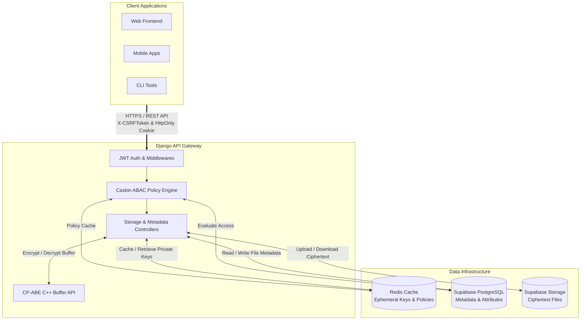

# Cloud Policy Crypto Access

A comprehensive enterprise-grade file storage system implementing **Hybrid Ciphertext-Policy Attribute-Based Encryption (CP-ABE)** integrated with **Supabase**, providing highly secure file management, multi-layer Attribute-Based Access Control (ABAC), and high-performance caching.

## Project Overview

This repository contains a robust Django-based implementation of a secure file sharing system. The system shifts away from traditional role-based security by enabling fine-grained access control mathematically bound to user attributes, providing zero-trust security for sensitive data.


See more demo images in `img/`.

### Key Features

- **Hybrid CP-ABE Encryption (v3.0.0)**: Advanced attribute-based encryption utilizing high-speed in-memory buffers (RAM) for encryption/decryption, completely bypassing disk I/O bottlenecks. See more at: https://github.com/WanThinnn/Hybrid-CP-ABE-Library.git 
- **Supabase Integration**: Leverages Supabase Storage for hosting encrypted files and Supabase PostgreSQL for high-performance metadata management.
- **Multi-Layer Security**: Combines **CP-ABE** (Mathematical Cryptography) with **Casbin ABAC** (Application-level Access Control) for defense-in-depth.
- **Intelligent Policy Combination**: Automatically re-encrypts and merges policies using `OR` logic when new access rights are granted to existing files.
- **Zero Frontend Key Exposure**: Private keys are strictly generated, utilized, and destroyed within the Backend's memory space.
- **Redis Caching**: Highly optimized Redis caching for CP-ABE Private Keys and Casbin policies, ensuring near-instantaneous file previews.
- **Dockerized Architecture**: Fully containerized environment with Nginx, Gunicorn, Django, and Redis for seamless production deployment.

## Technology Stack

### Backend & Infrastructure
- **Framework**: Django 5.x & Django REST Framework
- **Database & Storage**: Supabase PostgreSQL & Supabase Storage
- **Caching & Message Broker**: Redis 7
- **Web Server**: Nginx & Gunicorn
- **Deployment**: Docker & Docker Compose

### Security & Cryptography
- **Hybrid CP-ABE**: Custom C++ `libhybrid-cp-abe` (v3.1.0) bridged via Python `ctypes`
- **Access Control**: PyCasbin (Attribute-Based Access Control)
- **Authentication**: JWT (JSON Web Tokens)

## Architecture



### Workflow Overview

1. **Authentication & Authorization**: The client makes a request via HTTPS containing an `HttpOnly Cookie` (for JWT) and an `X-CSRFToken` header. The **Auth Middleware** verifies the identity, and the **Casbin ABAC Engine** evaluates the user's attributes against the stored policies (cached in Redis) to determine access rights.
2. **Encryption/Decryption (In-Memory)**: Upon an authorized file upload/download, the **Storage Controller** dynamically generates an ephemeral CP-ABE private key based on the user's current attributes. This key is temporarily cached in **Redis**. The data buffer is passed to the **CP-ABE C++ Library** to be encrypted or decrypted directly in RAM, ensuring plaintext data is never written to disk.
3. **Data Persistence**: File metadata, access policies, and user attributes are securely managed in **Supabase PostgreSQL**. The fully encrypted ciphertexts are uploaded to **Supabase Storage**.

## Quick Start

### Prerequisites
- Docker and Docker Compose
- Supabase Project (PostgreSQL URL & API Keys)
- `libhybrid-cp-abe.so` / `libhybrid-cp-abe.dll` (v3.0.0) placed in `src/lib/`

### Installation & Deployment

1. **Clone the Repository**
   ```bash
   git clone https://github.com/WanThinnn/Cloud-Policy-Crypto-Access.git
   cd Cloud-Policy-Crypto-Access
   ```

2. **Environment Configuration**
   Copy the example environment file and configure your Supabase credentials:
   ```bash
   cp .env.example .env
   # Edit .env and insert your SUPABASE_URL, SUPABASE_SERVICE_KEY, and DATABASE_URL
   ```

3. **Start the System**
   The system uses Docker Compose to spin up Django, Redis, and Nginx automatically.
   ```bash
   python start.py build
   python start.py up
   ```

4. **Initialize Database & Policies**
   The `start.py` script helps you manage the system easily:
   ```bash
   # Apply migrations and initialize default Casbin policies
   python start.py init
   
   # Create a super admin account
   docker exec -it django_app python manage.py createsuperuser
   ```

## Documentation

- **[Project Specifications (English)](docs/en/project-specs-en.md)**: Details the dual-layer architecture, attribute schemas, and system workflows.
- **[API Specifications (English)](docs/en/api-specs-en.md)**: Details the authentication flow, CP-ABE encryption workflow, and REST API endpoints.
- **[Đặc tả Dự án (Tiếng Việt)](docs/vi/project-specs.md)**
- **[Đặc tả API (Tiếng Việt)](docs/vi/api-specs.md)**

*Detailed Swagger/OpenAPI documentation is available at `/api/docs/` when the server is running.*

## Security Notice
- **Zero Persistent Keys**: CP-ABE private keys are never stored on disk or in the database. They are generated dynamically (on-the-fly) and temporarily cached in Redis.
- **XSS Protection**: JWT Tokens are securely stored in HttpOnly cookies, rendering them immune to XSS attacks.
- Ensure the `keys` directory is properly secured in production. The `cpabe_msk.key` (Master Key) must never be exposed.
- Always use `HTTPS` in production to prevent Man-in-the-Middle (MITM) attacks during token transmission.

## License
This project is licensed under the MIT License - see the [LICENSE](LICENSE) file for details.
