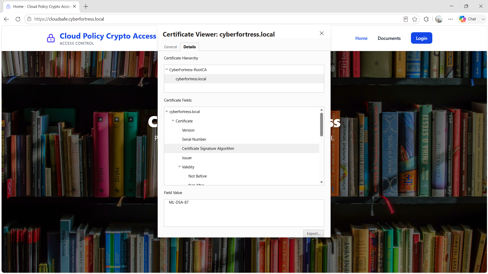
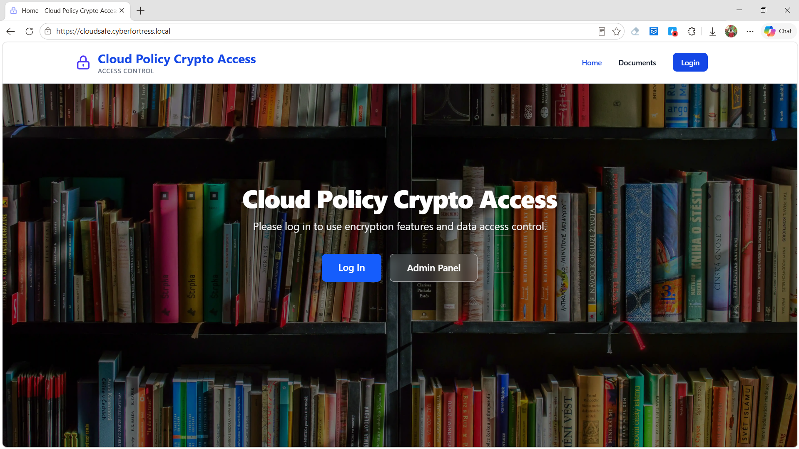
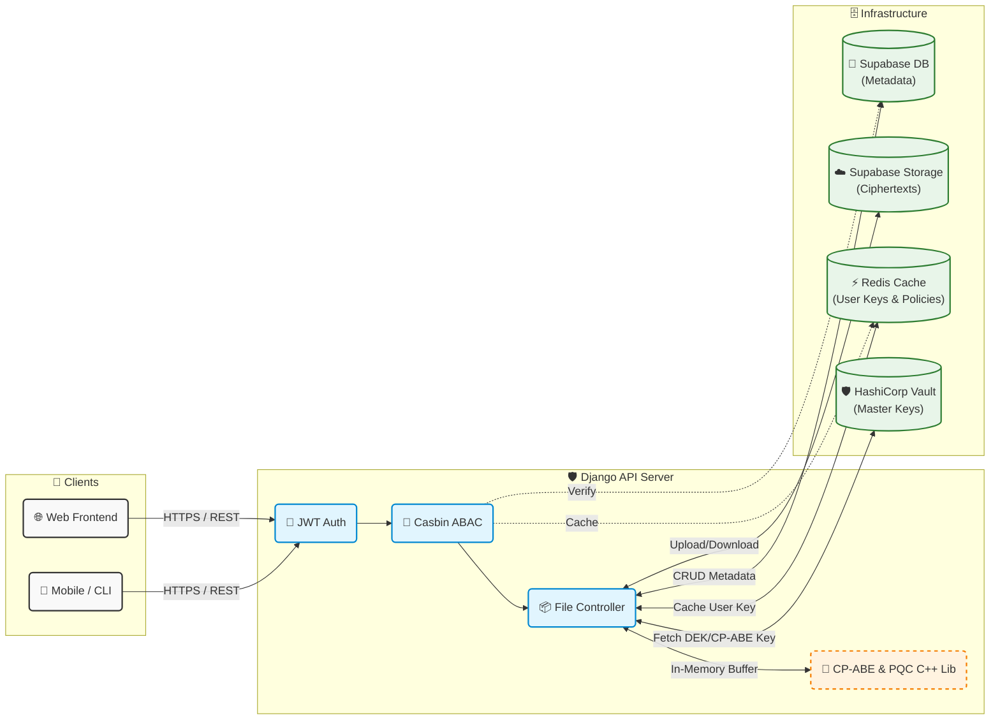

# Cloud Policy Quantum Access

A comprehensive enterprise-grade file storage system implementing **Hybrid Ciphertext-Policy Attribute-Based Encryption (CP-ABE)** integrated with **Supabase**, providing highly secure file management, multi-layer Attribute-Based Access Control (ABAC), and high-performance caching.

> [!NOTE]
> **PQC Only Repository:** This `main` branch exclusively supports Post-Quantum Cryptography (PQC) features. The legacy CP-ABE only version is maintained in the `legacy` branch.

> [!WARNING]
> **Post-Quantum TLS Requirement:** This system strictly enforces **Hybrid ML-KEM-768 (Kyber)** key exchange and **ML-DSA-87** certificates. You **MUST use Chrome or Edge version 150+** to successfully complete the TLS handshake. Older browsers or browsers without ML-DSA support will fail to connect.
> 


## Project Overview

This repository contains a robust Django-based implementation of a secure file sharing system. The system shifts away from traditional role-based security by enabling fine-grained access control mathematically bound to user attributes, providing zero-trust security for sensitive data.




See more demo images in `img/`.

### Key Features

- **Hybrid PQ-CP-ABE Encryption (v4.0.0)**: Advanced attribute-based encryption utilizing high-speed in-memory buffers (RAM) for encryption/decryption, completely bypassing disk I/O bottlenecks. See more at: https://github.com/WanThinnn/Hybrid-CP-ABE-Library/tree/hybrid-pq-cp-abe 
- **HashiCorp Vault Integration (Envelope Encryption)**: Enterprise-grade key management. Vault secures the CP-ABE Master Keys and dynamically wraps per-file Data Encryption Keys (DEK), ensuring keys are never leaked to the disk.
- **Supabase Integration**: Leverages Supabase Storage for hosting encrypted files and Supabase PostgreSQL for high-performance metadata management.
- **Multi-Layer Security**: Combines **HashiCorp Vault**, **CP-ABE AC17**, and **AES-GCM-256** (Mathematical Cryptography) with **Casbin ABAC** (Application-level Access Control) for defense-in-depth.
- **Field-Level SQL Encryption & Blind Indexing**: Protects sensitive metadata in the relational database. Fields such as physical paths, original filenames, signed URLs, and auto-extracted upload metadata are heavily encrypted using AES-256-GCM. Queries on these fields utilize HMAC-SHA3-256 Blind Indexes to maintain searchability while ensuring absolute privacy.
- **Advanced Policy Engine**: Implements an Abstract Syntax Tree (AST) evaluator for ABAC and CP-ABE policies, supporting arbitrarily complex nested boolean logic (e.g., `(A and B) or C`) with visual UI builder integration.
- **Intelligent Policy Combination**: Automatically re-encrypts and merges policies using `OR` logic when new access rights are granted to existing files.
- **Interactive File Management SPA**: A dynamic single-page file manager featuring hierarchical folder navigation, drag-and-drop uploads, clipboard operations (Copy/Cut/Paste), file versioning, soft-delete with Trash & Restore, inline renaming, and a visual CP-ABE Policy Builder.
- **Zero Frontend Key Exposure**: Private keys are strictly generated, utilized, and destroyed within the Backend's memory space.
- **Redis Caching**: Highly optimized Redis caching for CP-ABE Private Keys and Casbin policies, ensuring near-instantaneous file previews.
- **Advanced Security Hardening**: Implements **Content Security Policy (CSP)** to strictly prevent XSS, **Rate Limiting** to protect CPU-intensive CP-ABE operations against DoS/DDoS, and **Impossible Travel Detection** to block suspicious geographic login anomalies.
- **Device & Session Management**: Tracks all active devices using Stateful JWTs, allowing users to securely "Log Out All Other Devices" with a single click.
- **Granular SIEM JSON Logging**: Separated logs into 7 distinct JSON files (`auth`, `storage`, `policy`, `user`, `attributes`, `audit`, `system`), enriching events with contextual `user_id` and `user_name` for immediate ingestion by SIEM systems (e.g., Wazuh, Splunk, ELK).
- **O(1) Audit Log Integrity**: Uses Redis Hash Caching combined with a continuous cryptographic hash chain (Blockchain-style) to instantly verify log tampering in `O(1)` time, with a deep verification fallback.
- **Synchronous Early-Rejection ClamAV Integration**: Uploaded files are immediately scanned by a dedicated ClamAV container over a secure internal TLS 1.3 proxy. By evaluating the in-memory plaintext buffer *before* performing heavy CP-ABE encryption, the system achieves an "Early Rejection" posture—instantly aborting malicious uploads and alerting the user while saving significant server CPU and network bandwidth.
- **Chunked Processing & RAM Optimization**: The entire data pipeline (Hashing, ClamAV, Uploading) utilizes optimized streaming chunks, preventing RAM exhaustion on large files while strictly ensuring plaintext data is never written to disk.
- **Dual-Layer Post-Quantum Signatures**: Files are secured with a Dual-Layer signature architecture: an E2EE signature generated by the user on the Frontend (validating ownership) and a System-level ML-DSA signature on the Backend (validating ciphertext integrity). Frontend WebAssembly (WASM) verification is entirely non-blocking, ensuring a smooth UI experience during heavy cryptographic computations.
- **Cloudflare Tunnel Integration**: Easily expose the internal secure Nginx server to the public internet without opening inbound ports via secure Cloudflare Tunnels.
- **Dual-Layer OpenVPN Infrastructure**: A robust, built-in VPN gateway securing access to the internal network. It features a Post-Quantum VPN (`ML-DSA-87` signatures) and a Standard VPN (`prime256v1` ECC), alongside internal `dnsmasq` for dynamic subdomain routing (e.g., `cloudsafe.cyberfortress.local`, `vault.cyberfortress.local`).
- **Post-Quantum TLS Ready**: Built on the OpenQuantumSafe (OQS) Nginx fork, the system automatically enforces **Hybrid ML-KEM-768 (Kyber)** key exchange and **ML-DSA-87** certificates over TLS 1.3 to protect all data in transit from quantum computer attacks (Harvest Now, Decrypt Later).
- **Dockerized Architecture**: Fully containerized environment with Nginx, Gunicorn, Django, HashiCorp Vault, Redis, ClamAV, OpenVPN, and Cloudflared for seamless production deployment.
- **Dual-Track CI/CD Pipeline**: Optimized GitHub Actions workflow enabling automated concurrent deployments, dynamically tagging `latest` (stable branches) and `pqc-latest` (experimental branches) to Docker Hub via our integrated release shell script.

## Technology Stack

### Backend & Infrastructure
- **Framework**: Django 5.x & Django REST Framework
- **Database & Storage**: Supabase PostgreSQL & Supabase Storage
- **Security & Cryptography**: HashiCorp Vault, OpenQuantumSafe (OQS), Post-Quantum Hybrid TLS 1.3 (ML-KEM)
- **Caching & Message Broker**: Redis 7
- **Web Server**: OQS Nginx & Gunicorn
- **Deployment**: Docker & Docker Compose

### Security & Cryptography
- **Key Management**: HashiCorp Vault
- **Hybrid CP-ABE & PQC**: Custom C++ `libhybrid-pq-cp-abe` (v4.0.0) bridged via Python `ctypes`
- **Access Control**: PyCasbin (Attribute-Based Access Control)
- **Authentication**: JWT (JSON Web Tokens)

## Architecture


```mermaid
flowchart LR
    classDef client fill:#f9f9f9,stroke:#333,stroke-width:2px;
    classDef gateway fill:#e1f5fe,stroke:#0288d1,stroke-width:2px;
    classDef datalayer fill:#e8f5e9,stroke:#2e7d32,stroke-width:2px;
    classDef core fill:#fff3e0,stroke:#f57c00,stroke-width:2px,stroke-dasharray: 5 5;

    subgraph Clients ["📱 Clients"]
        direction TB
        Web("🌐 Web Frontend"):::client
        Mob("📱 Mobile / CLI"):::client
    end

    subgraph Gateway ["🛡️ Django API Server"]
        direction TB
        Auth("🔑 JWT Auth"):::gateway
        Casbin("🛂 Casbin ABAC"):::gateway
        Ctrl("📦 File Controller"):::gateway
        CPABE("🔐 CP-ABE & PQC C++ Lib"):::core
        
        Auth --> Casbin
        Casbin --> Ctrl
        Ctrl <-->|In-Memory Buffer| CPABE
    end

    subgraph DataLayer ["🗄️ Infrastructure"]
        direction TB
        Vault[("🛡️ HashiCorp Vault<br/>(Master Keys)")]:::datalayer
        Redis[("⚡ Redis Cache<br/>(User Keys & Policies)")]:::datalayer
        DB[("🐘 Supabase DB<br/>(Metadata)")]:::datalayer
        Storage[("☁️ Supabase Storage<br/>(Ciphertexts)")]:::datalayer
    end

    Web -->|HTTPS / REST| Auth
    Mob -->|HTTPS / REST| Auth
    
    Casbin -.->|Cache| Redis
    Casbin -.->|Verify| DB
    
    Ctrl <-->|Fetch DEK/CP-ABE Key| Vault
    Ctrl <-->|Cache User Key| Redis
    Ctrl <-->|CRUD Metadata| DB
    Ctrl <-->|Upload/Download| Storage
```

### Workflow Overview

1. **Authentication & Authorization**: The client makes a request via HTTPS containing an `HttpOnly Cookie` (for JWT) and an `X-CSRFToken` header. The **Auth Middleware** verifies the identity, and the **Casbin ABAC Engine** evaluates the user's attributes against the stored policies (cached in Redis) to determine access rights.
2. **Encryption/Decryption & PQC Signing (In-Memory)**: Upon an authorized file upload/download, the **Storage Controller** retrieves the CP-ABE Master Keys and ML-DSA keys from **HashiCorp Vault**. It generates an ephemeral CP-ABE private key based on the user's current attributes. This key is temporarily cached in **Redis**. The file itself is encrypted with a random AES-256-GCM DEK, and this DEK is then wrapped (encrypted) by CP-ABE. Finally, the payload is signed using **Post-Quantum ML-DSA**. The data buffer is passed to the **CP-ABE C++ Library** to be processed directly in RAM, ensuring plaintext data is never written to disk.
3. **Data Persistence**: File metadata, access policies, and user attributes are securely managed in **Supabase PostgreSQL**. The fully encrypted ciphertexts are uploaded to **Supabase Storage**.

## Quick Start (Step-by-Step for New Environments)

Follow these instructions to deploy the system from scratch on a brand new machine.

### 1. Prerequisites
- **Docker** and **Docker Compose** installed.
- **Python 3.10+** (if you want to run the management scripts locally).
- A **Supabase Project** (You will need the PostgreSQL Database URL, Project URL, and Service Role Key).

### 2. Get the Code & Crypto Library
```bash
# Clone this main repository
git clone https://github.com/WanThinnn/Cloud-Policy-Crypto-Access.git
cd Cloud-Policy-Crypto-Access

```
*Note: The required C++ cryptography library (`libhybrid-cp-abe` v4.0.0) is already included in the `src/lib/` directory of this repository by default. You only need to visit the [Hybrid-CP-ABE-Library repository](https://github.com/WanThinnn/Hybrid-CP-ABE-Library.git) if you wish to compile or update to a newer version.*

### 3. Environment Configuration
Create the `.env` file from the example template:
```bash
cp .env.example .env
```
Open `.env` in your text editor and fill in the missing critical values:
- `DJANGO_SECRET_KEY`: Generate a long random string.
- `DATABASE_URL`: Get this from your Supabase Dashboard -> Settings -> Database -> Connection string (URI). Make sure it ends with `?sslmode=require` if using Supabase.
- `SUPABASE_URL`: Your Supabase project URL (e.g., `https://xxxx.supabase.co`).
- `SUPABASE_SERVICE_KEY`: Your Supabase Service Role Key (Dashboard -> Settings -> API). **Do not use the public anon key!**
- `KEYS_DIR`: Keep as `./config/keys` to securely mount your encryption master keys outside the source code.
- `MASTER_FIELD_ENCRYPTION_KEY`: If using HashiCorp Vault, **leave this blank** and the system will auto-generate a secure 256-bit AES key and push it to Vault during `initdata`. If NOT using Vault, you must provide a URL-safe Base64 32-byte key.
- `ENABLE_PQC_FEATURES`: Set to `True` (default) to enable ML-DSA dual-layer signatures during file uploads. Set to `False` to fallback to standard CP-ABE encryption.
- `USE_EXTERNAL_TLS`: Set to `True` (default) to enable Nginx HTTPS and Post-Quantum TLS. Set to `False` to disable the external reverse proxy and test locally via HTTP (port 8080). Note: Internal services will still use zero-trust TLS.
- `SSL_CERT_FILE` & `SSL_KEY_FILE`: (Optional) By default, the system uses self-signed CyberFortress certs. To use your own certificates in production, place your `.crt` and `.key` files in the `./certs` folder and specify their filenames here.

### 4. Setup Supabase Storage
Before running the system, configure your storage:
1. Go to your Supabase Dashboard.
2. Navigate to **Storage**.
3. Create a new bucket (e.g., `secure-storage`).
4. Ensure the bucket is set to **Private** (do not allow public access).

### 5. Build and Start Docker Containers
The system uses Docker Compose to orchestrate Django, Redis, Nginx, Vault, and OpenVPN. A `start.py` script is provided to simplify commands.
```bash
# Build the Docker images (including VPN layers)
python start.py --vpn build

# Start all containers in detached mode (including VPN)
python start.py --vpn up
```

### 6. Initialize Database & Create Super Admin
Once the containers are successfully running (`python start.py --vpn status`), initialize the system. The `initdata` command will automatically migrate the database, seed ABAC policies, configure HashiCorp Vault, and create a default super admin account.
```bash
# Initialize DB, seed policies, and auto-create super admin (super_admin/super_admin123)
python start.py --vpn initdata
```
*(Optional)* If you wish to create a custom super admin manually:
```bash
python start.py createsuperuser
```

### 7. Generate VPN Client Profiles (Optional but Recommended)
If you wish to access the internal network securely via OpenVPN, you can generate client profiles automatically. Ensure `VPN_PUBLIC_IP` and `DOMAIN_NAME` are correctly set in your `.env`.

```bash
# Generate both PQC and Standard client profiles for a user (e.g., 'johndoe')
python start.py --vpn vpn_client johndoe
```
This command outputs two `.ovpn` files to your host machine (`johndoe_pqc.ovpn` and `johndoe_classic.ovpn`), complete with embedded keys and TLS-Crypt-V2 metadata.

*(Advanced)* You can also generate your own PQC Root CA and Server certificates to a specific directory:
```bash
python start.py gencerts ./my_custom_certs
```

### 8. Access the Application
- If `USE_EXTERNAL_TLS=True` (default), open your web browser and navigate to: **`https://localhost`** or **`https://cloudsafe.cyberfortress.local`** (if connected via VPN or configured in `hosts`).
- If `USE_EXTERNAL_TLS=False`, navigate to: **`http://localhost:8080`**
- Log in using the Super Admin credentials you just created.
- Upon login, navigate to the **Manage** section to start creating User Types, defining Attribute Schemas, assigning attributes to users, and uploading files!

## Documentation

- **[Project Specifications (English)](docs/en/project-specs-en.md)**: Details the dual-layer architecture, attribute schemas, and system workflows.
- **[API Specifications (English)](docs/en/api-specs-en.md)**: Details the authentication flow, CP-ABE encryption workflow, and REST API endpoints.
- **[Đặc tả Dự án (Tiếng Việt)](docs/vi/project-specs.md)**
- **[Đặc tả API (Tiếng Việt)](docs/vi/api-specs.md)**

*Detailed Swagger/OpenAPI documentation is available at `/api/docs/` when the server is running.*

## Security Notice
- **Zero Persistent Keys**: CP-ABE private keys are never stored on disk or in the database. They are generated dynamically (on-the-fly) and temporarily cached in Redis.
- **XSS & Attack Protection**: JWT Tokens are securely stored in HttpOnly cookies and combined with a strict **Content Security Policy (CSP)**.
- **DoS/DDoS Protection**: Critical endpoints (upload/download/preview) are heavily rate-limited by Django REST Framework Throttling using Redis to prevent CPU exhaustion from malicious CP-ABE generation requests.
- Ensure the `keys` directory is properly secured in production. The `cpabe_msk.key` (Master Key) must never be exposed. Development keys in `src/keys/` are automatically git-ignored.
- **Disaster Recovery / Migration**: The CP-ABE Public Key and Master Key are **automatically generated** by the backend upon startup if they do not exist in the `./keys` folder. However, if you migrate your server or move to a completely new machine, you **MUST** manually copy the `cpabe_pub.key` and `cpabe_msk.key` from your old machine to the new `./keys` directory. If you lose the old Master Key, all previously encrypted files in your storage will become permanently inaccessible.
- **Metadata Privacy**: Real physical file paths are obfuscated using random UUIDs on the Cloud Storage side, ensuring that cloud providers or infrastructure attackers cannot infer directory structures or file identities.
- Always use `HTTPS` in production to prevent Man-in-the-Middle (MITM) attacks during token transmission.

## License
This project is licensed under the MIT License - see the [LICENSE](LICENSE) file for details.
